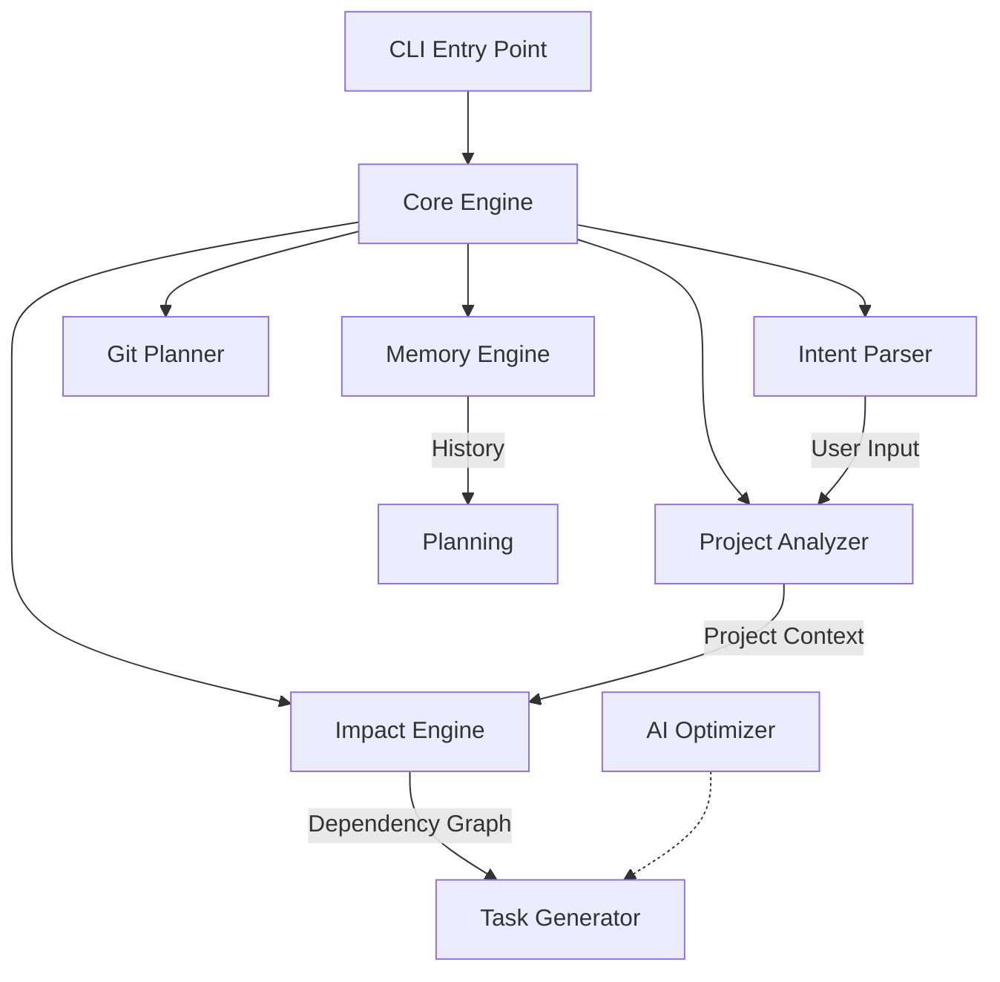

# Intent CLI - Architecture Document

## High-Level Diagram

## Modules Responsibility

### 1. Intent Parser (`src/core/Parser`)
- **Role**: Validates and structures raw user input.
- **Input**: Natural language string (e.g. "add user registration").
- **Output**: `IntentObject` { action: 'ADD', object: 'Feature', description: '...' }.
- **Component**: `Analyzer`.

### 2. Project Analyzer (`src/core/Analyzer`)
- **Role**: Scans the codebase to understand the current state.
- **Features**:
  - File tree traversal.
  - Pattern matching for Laravel/React.
  - Dependency detection.

### 3. Impact Engine (`src/core/Impact`)
- **Role**: Calculates what needs change.
- **Logic**: 
  - If `User` model changes -> check `UserController`, `UserResource`, `migrations`.

### 4. Task Generator (`src/core/Roadmap`)
- **Role**: Prompts the AI or uses heuristics to generate step-by-step tasks.
- **Output**: JSON list of tasks `Task[]`.

### 5. Git Planner (`src/core/Roadmap` - integrated)
- **Role**: Manages Version Control integration.
- **Features**: Branch naming, commit messages.

### 6. Memory Engine (`src/core/Memory`)
- **Role**: Persists project metadata and intent history.
- **Storage**: `JSON` via `conf` or `lowdb`.

## Tech Stack
- **Runtime**: Node.js
- **Language**: TypeScript
- **CLI Framework**: Commander.js
- **State Management**: LowDB
- **UI**: Inquirer, Chalk, Ora
